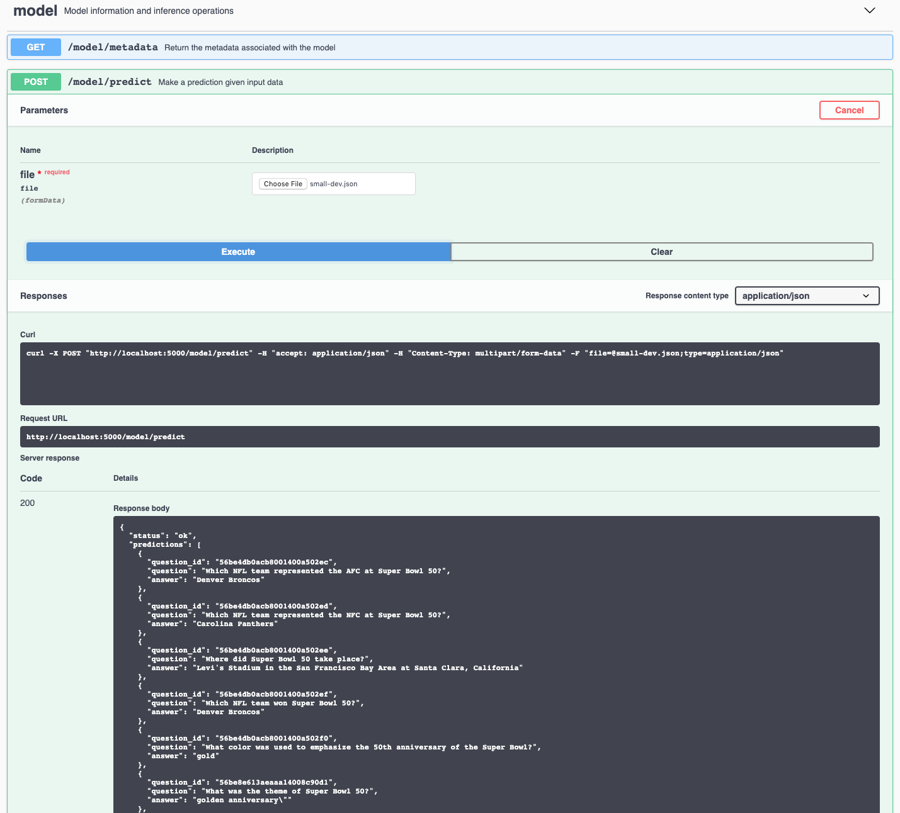

[](https://travis-ci.com/IBM/[MODEL REPO NAME]) [](http://[MODEL DOCKER TAG].max.us-south.containers.appdomain.cloud/)

[](http://ibm.biz/max-to-ibm-cloud-tutorial)

# IBM Developer Model Asset Exchange: [Question/Response Model]

This repository contains code to instantiate and deploy a Question/Response model. Given a body of text (context) about a subject and questions about that subject, the model will answer questions based on the given context. The input of this 

The model is based on the [BERT model](https://github.com/google-research/bert). The model files are hosted on
[IBM Cloud Object Storage]([LINK TO SPECIFIC SOFTLAYER LOCATION]).
The code in this repository deploys the model as a web service in a Docker container. This repository was developed
as part of the [IBM Developer Model Asset Exchange](https://developer.ibm.com/exchanges/models/) and the public API is powered by [IBM Cloud](https://ibm.biz/Bdz2XM).

## Model Metadata
| Domain | Application | Industry  | Framework | Training Data | Input Data Format |
| ------------- | --------  | -------- | --------- | --------- | -------------- | 
| [Natural Language Processing] | [Question and Answer] | [General] | [TensorFlow] | [SQuAD 1.1](https://rajpurkar.github.io/SQuAD-explorer/) | [Text] |

_Note: the SQuAD 1.1 files are no longer on the dataset website but can be found on the [Google BERT](https://github.com/google-research/bert) repo_

## Benchmark

The predictive performance of the model can be characterized by the benchmark table below.

_Note: The performance of a model is not the only significant metric. The level of bias and fairness incorporated in the model are also of high importance. Learn more by reading up on the [AI Fairness 360 open source toolkit](http://ibm.biz/AI_Fairness_360)._


|  | [SQuAD 1.1] | [DATASET 2]   | [DATASET 3]  |
| -------- | --------  | -------- | --------- |
| [f1 Score] | [88.7] | [VALUE] | [VALUE] |
| [Exact Match] | [81.3] | [VALUE] | [VALUE] |

## References

> This section should include links to relevant papers, github repos and dataset home pages. Please follow the standard format for references.

* _[J. Devlin, M. Chang, K. Lee, K. Toutanova]_, ["BERT: Pre-training of Deep Bidirectional Transformers for Language Understanding"]([https://arxiv.org/abs/1810.04805]), [arXiv], [2018].
* [Google BERT](https://github.com/google-research/bert)
* [SQuAD Dataset](https://rajpurkar.github.io/SQuAD-explorer/) and version 1.1 on the [Google BERT](https://github.com/google-research/bert) repo

## Licenses

| Component | License | Link  |
| ------------- | --------  | -------- |
| This repository | [Apache 2.0](https://www.apache.org/licenses/LICENSE-2.0) | [LICENSE](LICENSE) |
| Model Weights |  [Apache 2.0](https://www.apache.org/licenses/LICENSE-2.0) | [LICENSE](LICENSE)
| Model Code (3rd party) | [Apache 2.0](https://www.apache.org/licenses/LICENSE-2.0) | [LICENSE](https://github.com/google-research/bert/blob/master/LICENSE) |
| Test samples | [CC BY-SA 4.0](https://creativecommons.org/licenses/by-sa/4.0/legalcode) | [samples README](samples/README.md) |

## Pre-requisites:

* `docker`: The [Docker](https://www.docker.com/) command-line interface. Follow the [installation instructions](https://docs.docker.com/install/) for your system.
* The minimum recommended resources for this model is [SET NECESSARY GB] Memory and [SET NECESSARY CPUs] CPUs.

# Steps

1. [Deploy from Docker Hub](#deploy-from-docker-hub)
2. [Deploy on Kubernetes](#deploy-on-kubernetes)
3. [Run Locally](#run-locally)

## Deploy from Docker Hub

To run the docker image, which automatically starts the model serving API, run:

```
$ docker run -it -p 5000:5000 codait/[MODEL DOCKER TAG]
```

This will pull a pre-built image from Docker Hub (or use an existing image if already cached locally) and run it.
If you'd rather checkout and build the model locally you can follow the [run locally](#run-locally) steps below.

## Deploy on Kubernetes

You can also deploy the model on Kubernetes using the latest docker image on Docker Hub.

On your Kubernetes cluster, run the following commands:

```
$ kubectl apply -f https://github.ibm.com/CODAIT/[MODEL REPO NAME]/raw/master/[MODEL DOCKER TAG].yaml
```

The model will be available internally at port `5000`, but can also be accessed externally through the `NodePort`.

A more elaborate tutorial on how to deploy this MAX model to production on [IBM Cloud](https://ibm.biz/Bdz2XM) can be found [here](http://ibm.biz/max-to-ibm-cloud-tutorial).

## Run Locally

1. [Build the Model](#1-build-the-model)
2. [Deploy the Model](#2-deploy-the-model)
3. [Use the Model](#3-use-the-model)
4. [Development](#4-development)
5. [Cleanup](#5-cleanup)


### 1. Build the Model

Clone this repository locally. In a terminal, run the following command:

```
$ git clone https://github.ibm.com/CODAIT/[MODEL REPO NAME].git
```

Change directory into the repository base folder:

```
$ cd [MODEL REPO NAME]
```

To build the docker image locally, run: 

```
$ docker build -t [MODEL DOCKER TAG] .
```

All required model assets will be downloaded during the build process. _Note_ that currently this docker image is CPU only (we will add support for GPU images later).


### 2. Deploy the Model

To run the docker image, which automatically starts the model serving API, run:

```
$ docker run -it -p 5000:5000 [MODEL DOCKER TAG]
```

### 3. Use the Model

The API server automatically generates an interactive Swagger documentation page. Go to `http://localhost:5000` to load it. From there you can explore the API and also create test requests.

Use the `model/predict` endpoint to upload a test json file (you can use/alter the files from the `samples` folder) and get answers to the questions from the API.



You can also test it on the command line, for example:

```
$ curl -F "image=@assets/[SAMPLE FILE]" -XPOST http://localhost:5000/model/predict
```

You should see a JSON response like that below:

```json
{
  "status": "ok",
  "predictions": [
      [{"question_id": "56be4db0acb8001400a502ec", "question": "Which NFL team represented the AFC at Super Bowl 50?", "answer": "Denver Broncos"}, {"question_id": "56be4db0acb8001400a502ed", "question": "Which NFL team represented the NFC at Super Bowl 50?", "answer": "Carolina Panthers"}, {"question_id": "56be4db0acb8001400a502ee", "question": "Where did Super Bowl 50 take place?", "answer": "Levi's Stadium in the San Francisco Bay Area at Santa Clara, California"}, {"question_id": "56be4db0acb8001400a502ef", "question": "Which NFL team won Super Bowl 50?", "answer": "Denver Broncos"}, {"question_id": "56be4db0acb8001400a502f0", "question": "What color was used to emphasize the 50th anniversary of the Super Bowl?", "answer": "gold"}, {"question_id": "56be8e613aeaaa14008c90d1", "question": "What was the theme of Super Bowl 50?", "answer": "golden anniversary\""}, {"question_id": "56be8e613aeaaa14008c90d2", "question": "What day was the game played on?", "answer": "February 7, 2016"}, {"question_id": "56be8e613aeaaa14008c90d3", "question": "What is the AFC short for?", "answer": "American Football Conference"}]
  ]
}
```

### 4. Development

> Please remember to set `DEBUG = False` when publishing the model. 

To run the Flask API app in debug mode, edit `config.py` to set `DEBUG = True` under the application settings. You will then need to rebuild the docker image (see [step 1](#1-build-the-model)).

### 5. Cleanup

To stop the Docker container, type `CTRL` + `C` in your terminal.

